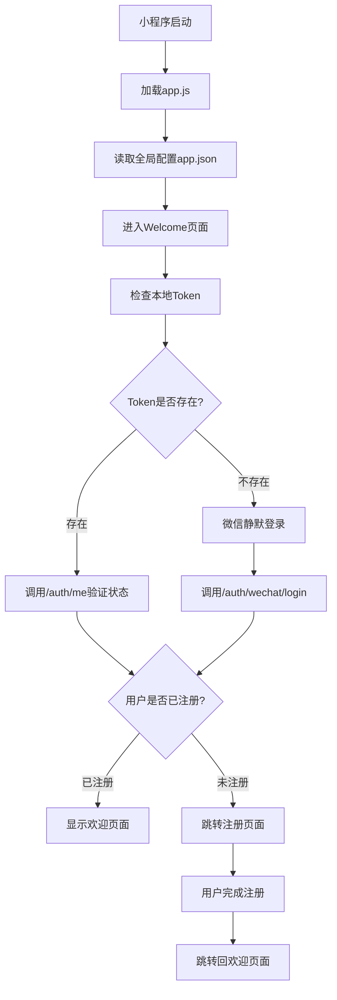

# 客户端架构文档 (Client Structure)

## 项目概述

罡好饭微信小程序客户端 - 基于微信小程序框架开发的内部公司餐饮订餐系统前端，支持用户认证、订餐、余额管理等核心功能。

## 技术栈

- **框架**: 微信小程序原生框架
- **语言**: JavaScript (ES6+)
- **样式**: WXSS (WeChat Style Sheets)
- **模块系统**: CommonJS (require/module.exports)
- **UI组件**: 微信小程序原生组件
- **网络请求**: 封装的request工具库

## 项目结构

```
client/
├── app.js                 # 小程序主入口文件
├── app.json              # 小程序全局配置
├── app.wxss              # 全局样式文件
├── config/               # 配置文件目录
│   ├── index.js          # 配置入口文件
│   ├── config.dev.js     # 开发环境配置
│   └── config.prod.js    # 生产环境配置
├── pages/                # 页面目录
│   ├── index/            # 首页（已废弃，保留作参考）
│   ├── welcome/          # 欢迎页面（主入口）
│   └── register/         # 用户注册页面
└── utils/                # 工具类目录
    └── request.js        # 网络请求封装
```

## 核心架构设计

### 1. 配置管理架构

#### 环境隔离设计
```javascript
// config/index.js - 配置入口
const ENV = 'dev'  // 环境标识
const configFiles = {
  'dev': require('./config.dev.js'),
  'prod': require('./config.prod.js')
}
module.exports = configFiles[ENV]
```

#### 配置项结构
```javascript
{
  baseURL: String,        // API服务器地址
  apiPrefix: String,      // API路径前缀
  timeout: Number,        // 请求超时时间
  debug: Boolean          // 调试模式开关
}
```

### 2. 网络请求架构

#### 请求封装层 (utils/request.js)
- **统一请求处理**: 封装微信的wx.request
- **Token自动管理**: 自动添加Authorization头
- **错误统一处理**: 标准化错误响应格式
- **配置集中管理**: 从config模块获取服务器配置

#### 请求方法
```javascript
{
  get(url, data),           // GET请求
  post(url, data),          // POST请求  
  put(url, data),           // PUT请求
  delete(url, data)         // DELETE请求
}
```

### 3. 用户认证架构

#### 三状态用户模型
```
未知用户 (Unknown)
    ↓ 微信静默登录
未注册用户 (Unregistered) 
    ↓ 完成个人信息
已注册用户 (Registered)
```

#### Token管理机制
- **存储方式**: 微信小程序localStorage (`wx.getStorageSync/setStorageSync`)
- **自动携带**: request.js自动在请求头中添加Token
- **失效处理**: 401/403错误时自动清除Token并引导重新登录

## 页面架构与流转

### 1. 页面层级结构

```
App启动
    ↓
Welcome页面 (主入口)
    ├─→ Register页面 (未注册用户)
    │        ↓ 注册完成
    │        └─→ 返回Welcome页面
    └─→ Meals页面 (已注册用户) [待开发]
            └─→ 其他功能页面 [待开发]
```

### 2. 页面间数据流

#### Welcome → Register
- **触发条件**: 用户未注册 (`wechat_name` 为空)
- **传递数据**: 通过Token间接传递用户身份
- **跳转方式**: `wx.redirectTo` (不可返回)

#### Register → Welcome  
- **触发条件**: 注册成功完成
- **传递数据**: 更新本地用户信息存储
- **跳转方式**: `wx.redirectTo` (不可返回)

### 3. 页面生命周期管理

#### Welcome页面生命周期
```
onLoad → 
  检查Token状态 → 
    有Token: 验证用户状态 → 显示欢迎页/跳转注册页
    无Token: 微信静默登录 → 根据注册状态处理
```

#### Register页面生命周期  
```
onLoad → 
  初始化表单状态 → 
  用户填写信息 → 
  提交注册 → 
  跳转Welcome页面
```

## 核心工作流程

### 1. 应用启动流程



### 2. 用户认证流程

#### 静默登录流程
1. **获取微信Code**: `wx.login()` 获取临时授权码
2. **服务器验证**: 发送code到 `/auth/wechat/login`
3. **状态判断**: 根据返回的 `is_registered` 字段判断用户状态
4. **Token存储**: 保存返回的 `access_token` 到本地存储
5. **页面跳转**: 根据用户状态显示相应页面

#### 注册完成流程
1. **表单验证**: 检查昵称和头像信息完整性
2. **提交注册**: 调用 `/auth/register` 接口
3. **状态更新**: 更新本地用户信息存储
4. **页面跳转**: 跳转回欢迎页面

### 3. 错误处理流程

#### Token失效处理
```
API返回401/403 → 
清除本地Token和用户信息 → 
跳转到相应页面重新认证
```

#### 网络错误处理
```
网络请求失败 → 
显示错误提示Toast → 
根据错误类型决定后续操作
```

## 数据管理架构

### 1. 本地存储策略

#### 存储的数据类型
```javascript
{
  'access_token': String,      // JWT访问令牌
  'user_info': Object,         // 用户详细信息
  'userInfo': Object          // 页面显示用的用户信息
}
```

#### 数据生命周期
- **创建时机**: 登录成功或注册完成时
- **更新时机**: 用户信息变更时
- **清理时机**: Token失效或主动登出时

### 2. 状态同步机制

#### 页面间状态同步
- **方式**: 通过本地存储进行数据传递
- **时机**: 页面onShow时重新读取存储数据
- **一致性**: 确保所有页面看到的用户状态一致

## 开发规范

### 1. 代码组织规范

#### 文件命名
- **页面文件**: 使用小写字母和下划线 (如: `page_welcome.js`)
- **工具文件**: 使用小写字母 (如: `request.js`)
- **配置文件**: 使用配置类型前缀 (如: `config.dev.js`)

#### 函数命名
- **生命周期**: 使用小程序标准生命周期名称
- **事件处理**: 使用 `on + 动作 + Tap/Change` 格式
- **业务方法**: 使用动词开头的驼峰命名

### 2. 异步处理规范

#### Promise和async/await
```javascript
// 统一使用async/await处理异步操作
async onRegisterTap() {
  try {
    const response = await request.post('/auth/register', data)
    // 处理成功情况
  } catch (error) {
    // 处理错误情况
  }
}
```

### 3. 错误处理规范

#### 统一错误提示
```javascript
// 使用wx.showToast显示错误信息
wx.showToast({
  title: '错误信息',
  icon: 'none',
  duration: 2000
})
```

## 扩展性设计

### 1. 新页面添加流程
1. 在 `pages/` 目录下创建新页面文件夹
2. 在 `app.json` 中注册页面路径
3. 实现页面逻辑并遵循现有的架构模式
4. 更新相关文档

### 2. 新功能模块集成
1. 在 `utils/` 目录下添加工具类
2. 遵循现有的CommonJS模块规范
3. 在需要的页面中引入和使用

### 3. API接口扩展
1. 在 `utils/request.js` 中添加新的请求方法（如需要）
2. 保持统一的错误处理机制
3. 遵循现有的Token管理策略

## 性能优化策略

### 1. 资源加载优化
- **按需加载**: 页面级别的资源按需加载
- **图片优化**: 使用适当尺寸的图片资源
- **代码分割**: 工具类和页面逻辑分离

### 2. 用户体验优化
- **loading状态**: 异步操作时显示loading状态
- **错误友好**: 提供清晰的错误提示信息
- **流畅跳转**: 合理使用redirectTo和navigateTo

### 3. 存储优化
- **数据清理**: 及时清理无效的本地存储数据
- **存储大小**: 控制本地存储数据的大小
- **访问频率**: 减少不必要的存储读写操作

## 调试与测试

### 1. 开发环境调试
- **微信开发者工具**: 主要开发和调试工具
- **Mock数据**: 支持微信开发者工具提供的mock数据
- **网络调试**: 通过开发者工具查看网络请求

### 2. 日志管理
- **console.log**: 开发阶段的调试日志
- **错误日志**: 关键错误的日志记录
- **用户行为**: 重要用户操作的日志跟踪

### 3. 兼容性测试
- **微信版本**: 测试不同微信版本的API兼容性
- **设备适配**: 测试不同设备尺寸的页面适配
- **降级方案**: 验证API不可用时的降级方案