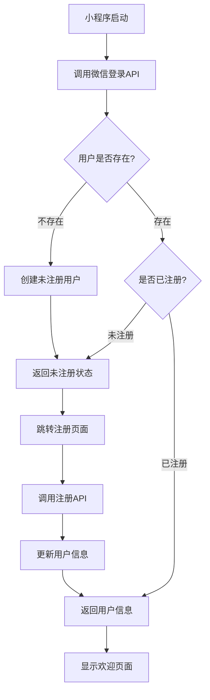

# 罡好饭 - 服务器架构设计文档

基于FastAPI + DuckDB的微信小程序服务端架构设计，采用模块化、配置化、文档驱动的开发模式。

## 架构概览

### 技术栈
- **Web框架**: FastAPI (异步高性能)
- **数据库**: DuckDB (嵌入式分析数据库)
- **认证**: JWT + 微信OAuth
- **环境管理**: Conda
- **部署**: Docker可选，支持Linux/Windows

### 设计原则
1. **文档驱动开发**: API文档与代码双向同步
2. **配置分层管理**: 多环境配置支持
3. **模块化架构**: 职责分离，易于维护
4. **类型安全**: Pydantic数据验证
5. **生产就绪**: 完整的日志、监控、错误处理

## 目录结构详解

```
server/
├── environments/           # Conda环境配置
│   ├── environment.yml    # 生产环境依赖
│   ├── environment-dev.yml # 开发环境依赖（含测试工具）
│   └── requirements.txt   # pip备用方案
├── scripts/               # 启动和维护脚本
│   ├── start.sh          # Linux生产启动
│   ├── start.bat         # Windows生产启动
│   ├── start_dev.sh      # Linux本地开发模式
│   ├── start_dev.bat     # Windows本地开发模式
│   ├── start_dev_remote.sh  # Linux远程开发模式
│   ├── start_dev_remote.bat # Windows远程开发模式
│   └── init_db.py        # 数据库初始化脚本
├── config/               # 分层配置管理
│   ├── config.json       # 基础配置模板
│   ├── config-dev.json   # 本地开发环境配置
│   ├── config-dev-remote.json  # 远程开发环境配置
│   └── config-prod.json  # 生产环境配置
├── api/                  # API业务逻辑层
│   ├── __init__.py
│   ├── main.py          # FastAPI应用入口
│   ├── auth/            # 微信认证模块
│   │   ├── __init__.py
│   │   ├── routes.py    # 认证路由（静默登录+注册）
│   │   ├── models.py    # 认证数据模型
│   │   └── wechat_service.py    # 微信OAuth集成
│   ├── meals/           # 餐次管理模块
│   │   ├── __init__.py
│   │   ├── routes.py    # 餐次API路由
│   │   ├── models.py    # 数据模型
│   │   └── schemas.py   # Pydantic验证模式
│   ├── orders/          # 订单管理模块
│   │   ├── __init__.py
│   │   ├── routes.py    # 订单API路由
│   │   ├── models.py    # 数据模型
│   │   └── schemas.py   # Pydantic验证模式
│   ├── users/           # 用户管理模块
│   │   ├── __init__.py
│   │   ├── routes.py    # 用户API路由
│   │   └── schemas.py   # Pydantic验证模式
│   ├── admin/           # 管理员功能模块
│   │   ├── __init__.py
│   │   ├── routes.py    # 管理员API路由
│   │   └── schemas.py   # 管理员专用模式
│   └── middleware/      # 中间件
│       ├── __init__.py
│       ├── cors.py      # 跨域处理
│       ├── logging.py   # 请求日志中间件
│       └── auth.py      # JWT认证中间件
├── db/                  # 数据访问层
│   ├── __init__.py
│   ├── manager.py       # 数据库连接管理器
│   ├── core_operations.py    # 核心业务操作
│   ├── query_operations.py   # 查询操作
│   └── supporting_operations.py # 支持操作
├── utils/               # 工具函数库
│   ├── __init__.py
│   ├── logger.py        # 日志配置管理
│   ├── security.py      # 安全工具（JWT、加密）
│   └── validators.py    # 数据验证器
├── tests/               # 测试套件
│   ├── test_api/        # API测试
│   │   ├── __init__.py
│   │   ├── test_auth.py
│   │   ├── test_meals.py
│   │   ├── test_orders.py
│   │   └── test_admin.py
│   ├── test_db/         # 数据库操作测试
│   │   ├── __init__.py
│   │   ├── test_core_operations.py
│   │   ├── test_query_operations.py
│   │   └── test_supporting_operations.py
│   └── conftest.py      # pytest配置和fixture
└── logs/               # 日志文件目录
    ├── app.log         # 应用日志
    ├── error.log       # 错误日志
    └── access.log      # 访问日志
```

## 模块功能说明

### 1. environments/ - 环境管理
**作用**: 使用Conda管理Python环境和依赖

**environment.yml (生产环境)**
```yaml
name: ganghaofan-server
channels:
  - conda-forge
  - defaults
dependencies:
  - python=3.11
  - pip
  - pip:
    - fastapi==0.104.1
    - uvicorn[standard]==0.24.0
    - duckdb==0.9.2
    - pydantic==2.5.0
    - python-jose[cryptography]==3.3.0
    - python-multipart==0.0.6
    - httpx==0.25.0
```

**environment-dev.yml (开发环境)**
```yaml
name: ganghaofan-server-dev
channels:
  - conda-forge
  - defaults
dependencies:
  - python=3.11
  - pip
  - pip:
    - fastapi==0.104.1
    - uvicorn[standard]==0.24.0
    - duckdb==0.9.2
    - pydantic==2.5.0
    - python-jose[cryptography]==3.3.0
    - python-multipart==0.0.6
    - httpx==0.25.0
    # 开发工具
    - pytest==7.4.3
    - pytest-asyncio==0.21.1
    - black==23.10.1
    - flake8==6.1.0
```

### 2. scripts/ - 启动脚本
**作用**: 跨平台启动和维护脚本

**start.sh (Linux生产启动)**
```bash
#!/bin/bash
set -e

# 激活conda环境
source $(conda info --base)/etc/profile.d/conda.sh
conda activate ganghaofan-server

# 设置环境变量
export PYTHONPATH="${PYTHONPATH}:$(pwd)"
export CONFIG_ENV="production"

# 数据库初始化检查
python scripts/init_db.py

# 启动服务
echo "启动罡好饭API服务（生产模式）..."
uvicorn api.main:app --host 0.0.0.0 --port 8000 --workers 4 --no-reload
```

**start_dev.sh (Linux本地开发启动)**
```bash
#!/bin/bash
set -e

# 激活开发环境
source $(conda info --base)/etc/profile.d/conda.sh
conda activate ganghaofan-server-dev

# 设置本地开发环境变量
export PYTHONPATH="${PYTHONPATH}:$(pwd)"
export CONFIG_ENV="development"

# 数据库初始化
python scripts/init_db.py

# 启动本地开发服务（热重载）
echo "启动罡好饭API服务（本地开发模式）..."
uvicorn api.main:app --host 127.0.0.1 --port 8000 --reload --log-level debug
```

**start_dev_remote.sh (Linux远程开发启动)**
```bash
#!/bin/bash
set -e

# 激活开发环境
source $(conda info --base)/etc/profile.d/conda.sh
conda activate ganghaofan-server-dev

# 设置远程开发环境变量
export PYTHONPATH="${PYTHONPATH}:$(pwd)"
export CONFIG_ENV="development-remote"

# 数据库初始化
python scripts/init_db.py

# 启动远程开发服务（外部访问）
echo "启动罡好饭API服务（远程开发模式）..."
uvicorn api.main:app --host 0.0.0.0 --port 8000 --reload --log-level debug
```

### 3. config/ - 配置管理
**作用**: 分层配置管理，支持环境变量替换

**config.json (基础配置模板)**
```json
{
  "app": {
    "name": "罡好饭API服务",
    "version": "1.0.0",
    "debug": false,
    "description": "内部餐饮预订系统API服务"
  },
  "server": {
    "host": "0.0.0.0",
    "port": 8000,
    "workers": 4,
    "reload": false
  },
  "database": {
    "path": "data/gang_hao_fan.db",
    "memory_limit": "1GB",
    "threads": 4,
    "backup_enabled": true,
    "backup_schedule": "0 2 * * *"
  },
  "auth": {
    "jwt_secret_key": "${JWT_SECRET_KEY}",
    "jwt_algorithm": "HS256",
    "access_token_expire_minutes": 1440,
    "wechat_app_id": "${WECHAT_APP_ID}",
    "wechat_app_secret": "${WECHAT_APP_SECRET}"
  },
  "admin": {
    "whitelist_open_ids": [
      "admin_openid_mock"
    ]
  },
  "logging": {
    "level": "INFO",
    "format": "%(asctime)s - %(name)s - %(levelname)s - [%(filename)s:%(lineno)d] - %(message)s",
    "file_enabled": true,
    "file_path": "logs/app.log",
    "max_file_size": "10MB",
    "backup_count": 5
  },
  "business": {
    "order_deadline": {
      "lunch": "10:30",
      "dinner": "16:30"
    },
    "default_meal_capacity": 50,
    "timezone": "Asia/Shanghai"
  },
  "cors": {
    "allow_origins": ["*"],
    "allow_methods": ["GET", "POST", "PUT", "DELETE"],
    "allow_headers": ["*"],
    "allow_credentials": true
  }
}
```

### 4. api/ - API业务逻辑层
**作用**: FastAPI路由和业务逻辑，严格对应doc/api.md文档

#### 4.1 认证模块设计 (api/auth/)
**新的三状态用户管理系统**:

1. **未知用户**: OpenID 不存在于数据库
2. **未注册用户**: OpenID 存在但 wechat_name 为空
3. **已注册用户**: OpenID 存在且 wechat_name 非空

**API接口设计**:
- `POST /api/auth/wechat/login` - 微信静默登录（获取或创建用户）
- `POST /api/auth/register` - 完成用户注册（更新个人信息）

**认证流程**:


**main.py (应用入口)**
```python
from fastapi import FastAPI
from fastapi.middleware.cors import CORSMiddleware
from api.middleware import setup_middleware
from api.auth.routes import router as auth_router
from api.meals.routes import router as meals_router
from api.orders.routes import router as orders_router
from api.users.routes import router as users_router
from api.admin.routes import router as admin_router
from utils import setup_logging, get_config

# 加载配置
config = get_config()

# 创建应用
app = FastAPI(
    title=config['app']['name'],
    version=config['app']['version'],
    description=config['app']['description']
)

# 设置中间件
setup_middleware(app, config)

# 注册路由
app.include_router(auth_router, prefix="/api/auth", tags=["认证"])
app.include_router(meals_router, prefix="/api/meals", tags=["餐次"])
app.include_router(orders_router, prefix="/api/orders", tags=["订单"])
app.include_router(users_router, prefix="/api/users", tags=["用户"])
app.include_router(admin_router, prefix="/api/admin", tags=["管理"])

@app.get("/")
async def root():
    return {"message": "罡好饭API服务运行中", "version": config['app']['version']}
```

### 5. db/ - 数据访问层
**作用**: 严格按照doc/db/下的文档实现数据库操作

**manager.py**
```python
# 完全按照 doc/db/db_manager.md 实现
from doc.db.db_manager import DatabaseManager
```

**core_operations.py**
```python
# 完全按照 doc/db/core_operations.md 实现
from doc.db.core_operations import CoreOperations
```

### 6. utils/ - 工具函数库
**作用**: 通用工具函数，日志、安全、验证

**logger.py**
```python
import logging
import logging.handlers
import os
from typing import Dict, Any

def setup_logging(config: Dict[str, Any]):
    """根据配置设置日志系统"""
    log_config = config['logging']
    
    # 创建日志目录
    os.makedirs('logs', exist_ok=True)
    
    # 配置根日志器
    logger = logging.getLogger()
    logger.setLevel(getattr(logging, log_config['level']))
    
    # 格式化器
    formatter = logging.Formatter(log_config['format'])
    
    # 控制台处理器
    console_handler = logging.StreamHandler()
    console_handler.setFormatter(formatter)
    logger.addHandler(console_handler)
    
    # 文件处理器
    if log_config.get('file_enabled'):
        file_handler = logging.handlers.RotatingFileHandler(
            log_config['file_path'],
            maxBytes=_parse_size(log_config['max_file_size']),
            backupCount=log_config['backup_count']
        )
        file_handler.setFormatter(formatter)
        logger.addHandler(file_handler)
```

### 7. tests/ - 测试套件
**作用**: 完整的API和数据库测试覆盖

**conftest.py (测试配置)**
```python
import pytest
from fastapi.testclient import TestClient
from api.main import app
from db.manager import DatabaseManager

@pytest.fixture
def client():
    return TestClient(app)

@pytest.fixture
def test_db():
    db = DatabaseManager(":memory:")  # 内存数据库用于测试
    db.connect()
    # 初始化测试数据
    yield db
    db.close()
```

## 启动流程

### 本地开发环境启动
```bash
# Linux/Mac
cd server
chmod +x scripts/start_dev.sh
./scripts/start_dev.sh

# Windows
cd server
scripts\start_dev.bat
```

### 远程开发环境启动
```bash
# Linux/Mac
cd server
chmod +x scripts/start_dev_remote.sh
./scripts/start_dev_remote.sh

# Windows
cd server
scripts\start_dev_remote.bat
```

### 生产环境启动
```bash
# Linux/Mac
cd server
chmod +x scripts/start.sh
./scripts/start.sh

# Windows
cd server
scripts\start.bat
```

## 配置管理

### 环境变量配置
```bash
# 必需的环境变量
export JWT_SECRET_KEY="your-super-secret-jwt-key"
export WECHAT_APP_ID="your-wechat-app-id"
export WECHAT_APP_SECRET="your-wechat-app-secret"
export CONFIG_ENV="production"  # 或 "development" 或 "development-remote"
```

### 多环境支持
- **本地开发环境**: `CONFIG_ENV=development` → 加载 `config-dev.json`
- **远程开发环境**: `CONFIG_ENV=development-remote` → 加载 `config-dev-remote.json`
- **生产环境**: `CONFIG_ENV=production` → 加载 `config-prod.json`
- **默认**: 加载 `config.json`

## 文档同步机制

### API文档同步
1. **doc/api.md** ↔ **server/api/** 双向同步
2. 修改API路由时，同步更新API文档
3. 修改API文档时，同步更新路由实现

### 数据库文档同步
1. **doc/db/** → **server/db/** 严格实现
2. 数据库操作严格按照文档伪代码实现
3. 不允许偏离文档设计

## 部署建议

### Docker部署（可选）
```dockerfile
FROM python:3.11-slim

WORKDIR /app
COPY environments/environment.yml .
RUN pip install -r requirements.txt

COPY . .
EXPOSE 8000

CMD ["uvicorn", "api.main:app", "--host", "0.0.0.0", "--port", "8000"]
```

### 系统服务部署
```ini
# /etc/systemd/system/ganghaofan.service
[Unit]
Description=罡好饭API服务
After=network.target

[Service]
Type=exec
User=ganghaofan
WorkingDirectory=/opt/ganghaofan/server
ExecStart=/opt/ganghaofan/server/scripts/start.sh
Restart=always

[Install]
WantedBy=multi-user.target
```

## 监控和维护

### 日志管理
- **应用日志**: `logs/app.log` (轮转，30天保留)
- **错误日志**: `logs/error.log` (单独记录错误)
- **访问日志**: `logs/access.log` (HTTP访问记录)

### 数据库维护
```bash
# 数据库备份
python scripts/backup_db.py

# 数据库优化
python scripts/optimize_db.py
```

### 健康检查
```bash
# API健康检查
curl http://localhost:8000/

# 数据库连接检查
curl http://localhost:8000/health/db
```

## 开发规范

### 代码结构规范
1. 每个API模块包含: `routes.py`, `schemas.py`, `models.py`
2. 所有路由必须有对应的Pydantic模型验证
3. 数据库操作通过db模块统一访问
4. 工具函数放在utils模块

### 测试规范
1. API测试覆盖所有路由
2. 数据库测试覆盖所有操作
3. 使用pytest和内存数据库
4. 测试数据与生产数据隔离

### 文档规范
1. API变更必须同步更新doc/api.md
2. 数据库操作严格按照doc/db/实现
3. 配置变更必须更新本文档

这套架构确保了系统的可维护性、可扩展性和生产就绪性，为罡好饭餐饮预订系统提供了坚实的技术基础。